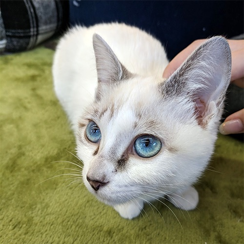
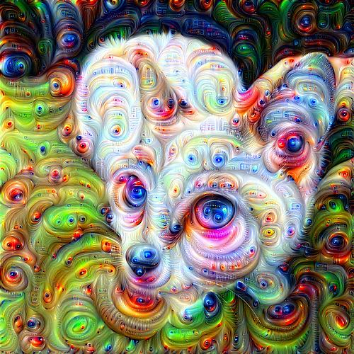

### DeepDream

    
    

 

Used the VGG19 model pretrained on Imagenet dataset to generate DeepDream images. The model is used to generate the gradients of the input image with respect to the activations of the layers in the model. The gradients are then added to the input image to inprint a dream-like effect on the image. This process is repeated multiple times to generate the DeepDream image.